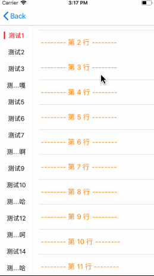
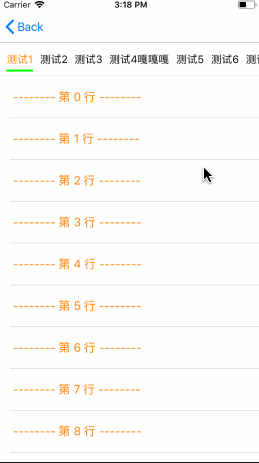

### 1.说明： 一款轻量级的TabView, 类似于新闻主页的联动视图以及分类显示的tab等UI可使用。

#### <font color = sky-blue> 效果 : </font>


&nbsp;&nbsp;&nbsp;&nbsp;&nbsp;&nbsp;&nbsp;&nbsp;&nbsp;&nbsp;&nbsp;&nbsp;&nbsp;&nbsp;


### 2. 引入库
#### 2.1 cocoapods引入
在podfile文件中添加

```objc
    pod 'HBTabView', '~> 1.0.0'
```

#### 2.2 手动导入
下载demo，将demo中的<font color = sky-blue>HBTabViewLib</font>文件夹拖拽到工程中即可

### 3. 使用方式

#### 3.1 创建tabView
两种样式，水平布局和垂直布局

```objc
typedef NS_ENUM(NSUInteger, HBTabViewShowType) {
    HBTabViewShowTypeHorizontal = 0,
    HBTabViewShowTypeVertical   = 1,
    HBTabViewShowTypeDefault    = HBTabViewShowTypeHorizontal,
};
```

```objc
HBTabView *tabView = [[HBTabView alloc] initWithFrame:CGRectMake(0, 0, kTabViewWidth, kTabViewHeight) parentViewController:self showType:HBTabViewShowTypeHorizontal];
```

#### 3.2 添加指定的控制器

```objc
    Test01ViewController *test01VC = [[Test01ViewController alloc] init];
    [tabView addItemWithTitle:@"测试1" containerViewWithViewController:test01VC];
    
    Test02ViewController *test02VC = [[Test02ViewController alloc] init];
    [tabView addItemWithTitle:@"测试2" containerViewWithViewController:test02VC];
    
    Test03ViewController *test03VC = [[Test03ViewController alloc] init];
    [tabView addItemWithTitle:@"测试3" containerViewWithViewController:test03VC];
    
    Test04ViewController *test04VC = [[Test04ViewController alloc] init];
    [tabView addItemWithTitle:@"测试4" containerViewWithViewController:test04VC];
    
    Test01ViewController *test05VC = [[Test01ViewController alloc] init];
    [tabView addItemWithTitle:@"测试5" containerViewWithViewController:test05VC];
    
    Test02ViewController *test06VC = [[Test02ViewController alloc] init];
    [tabView addItemWithTitle:@"测试6" containerViewWithViewController:test06VC];
    
    Test03ViewController *test07VC = [[Test03ViewController alloc] init];
    [tabView addItemWithTitle:@"测试7" containerViewWithViewController:test07VC];
    
    Test04ViewController *test08VC = [[Test04ViewController alloc] init];
    [tabView addItemWithTitle:@"测试8" containerViewWithViewController:test08VC];
    
    Test01ViewController *test09VC = [[Test01ViewController alloc] init];
    [tabView addItemWithTitle:@"测试9" containerViewWithViewController:test09VC];
    
    Test02ViewController *test010VC = [[Test02ViewController alloc] init];
    [tabView addItemWithTitle:@"测试10" containerViewWithViewController:test010VC];
```

#### 3.3 显示Tab

```objc
[tabView show];
```

### 说明： 非常轻量级的，使用过程就这么简单。
> 注：每个tab的联动的View(ViewController)都可以是独立的，互不影响。
>   indicator的颜色可以自己设置，选中的标题颜色均可设置。
